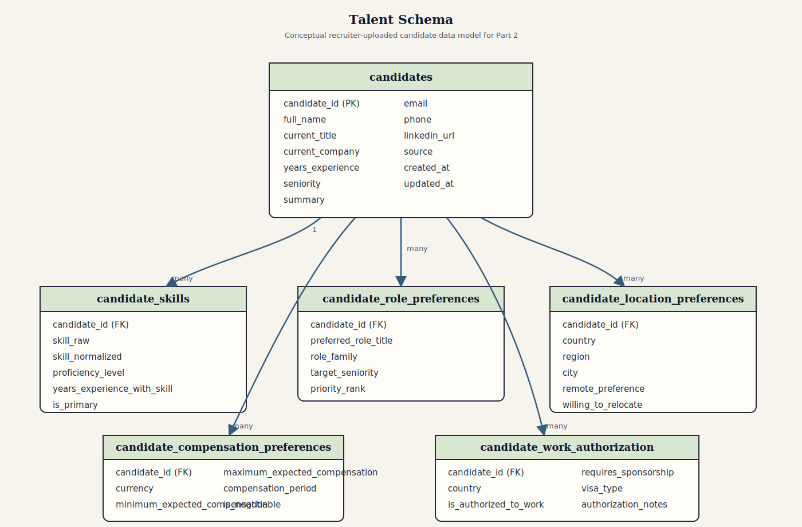
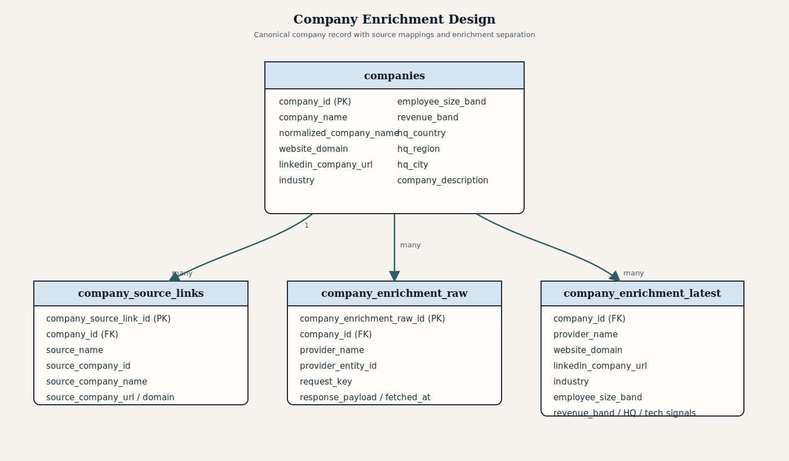

# Design Notes

This document contains the conceptual design notes for Part 2 and Part 3 of the case study.

## Part 2

### Talent Schema

The repo only contains job-posting data today, but the product also needs a schema for recruiter-uploaded candidate data. The proposed MVP talent model is:

- `candidates`
- `candidate_skills`
- `candidate_role_preferences`
- `candidate_location_preferences`
- `candidate_compensation_preferences`
- `candidate_work_authorization`

#### `candidates`

| Column | Description |
| --- | --- |
| `candidate_id` | Primary key |
| `full_name` | Candidate full name |
| `current_title` | Current or most recent title |
| `current_company` | Current or most recent company |
| `years_experience` | Total years of experience |
| `seniority` | Normalized seniority label |
| `summary` | Profile or resume summary |
| `email` | Primary contact email |
| `phone` | Primary contact phone |
| `linkedin_url` | LinkedIn profile URL |
| `source` | Recruiter upload, ATS import, or other source |

#### `candidate_skills`

| Column | Description |
| --- | --- |
| `candidate_id` | Foreign key to `candidates` |
| `skill_raw` | Original skill text |
| `skill_normalized` | Cleaned normalized skill |
| `proficiency_level` | Optional proficiency level |
| `years_experience_with_skill` | Optional years using the skill |
| `is_primary` | Flag for primary skills |

#### `candidate_role_preferences`

| Column | Description |
| --- | --- |
| `candidate_id` | Foreign key to `candidates` |
| `preferred_role_title` | Desired role title |
| `role_family` | Broader normalized role family |
| `target_seniority` | Preferred seniority |
| `priority_rank` | Relative priority when multiple preferences exist |

#### `candidate_location_preferences`

| Column | Description |
| --- | --- |
| `candidate_id` | Foreign key to `candidates` |
| `country` | Preferred country |
| `region` | Preferred region/state |
| `city` | Preferred city |
| `remote_preference` | `remote`, `hybrid`, or `onsite` |
| `willing_to_relocate` | Relocation flag |

#### `candidate_compensation_preferences`

| Column | Description |
| --- | --- |
| `candidate_id` | Foreign key to `candidates` |
| `currency` | Preferred compensation currency |
| `minimum_expected_compensation` | Lowest acceptable compensation |
| `maximum_expected_compensation` | Target or desired maximum |
| `compensation_period` | `annual`, `hourly`, or `daily` |
| `is_negotiable` | Negotiability flag |

#### `candidate_work_authorization`

| Column | Description |
| --- | --- |
| `candidate_id` | Foreign key to `candidates` |
| `country` | Country where authorization applies |
| `is_authorized_to_work` | Authorization flag |
| `requires_sponsorship` | Sponsorship requirement flag |
| `visa_type` | Visa or permit type |
| `authorization_notes` | Optional recruiter notes |

#### Talent Schema Diagram

Key relationship:
- `candidates` is the parent entity, and the other five tables are one-to-many child tables.

### Company Enrichment Design

The current job data has company names and some company URLs, but not a clean cross-source company master. A future company enrichment layer should support a canonical company record, raw provider payload storage, normalized enriched fields, and source traceability.

Recommended tables:

- `companies`
- `company_source_links`
- `company_enrichment_raw`
- `company_enrichment_latest`

#### `companies`

Canonical company entity with fields such as:
- `company_id`
- `company_name`
- `normalized_company_name`
- `website_domain`
- `linkedin_company_url`
- `industry`
- `employee_size_band`
- `revenue_band`
- `hq_country`
- `hq_region`
- `hq_city`
- `company_description`

#### `company_source_links`

Maps source-specific company references to the canonical company:
- `company_id`
- `source_name`
- `source_company_id`
- `source_company_name`
- `source_company_url`
- `source_website_domain`
- `match_confidence`
- `match_method`

#### `company_enrichment_raw`

Stores raw enrichment payloads from providers such as Apollo:
- `company_id`
- `provider_name`
- `provider_entity_id`
- `request_key`
- `response_payload`
- `fetched_at`

#### `company_enrichment_latest`

Stores the latest normalized enrichment fields used by the product:
- `company_id`
- `provider_name`
- `website_domain`
- `linkedin_company_url`
- `industry`
- `employee_size_band`
- `revenue_band`
- `hq_country`
- `hq_region`
- `hq_city`
- `company_description`
- `technology_signals`
- `last_enriched_at`

#### Raw vs Enriched Separation

- `company_enrichment_raw` keeps exact vendor payloads for auditability and reprocessing.
- `company_enrichment_latest` exposes clean normalized enrichment fields.
- `companies` remains the canonical business entity.

#### Useful Enriched Fields

For analytics:
- industry
- company size
- revenue band
- headquarters
- company description
- hiring or growth signals

For outbound:
- website domain
- LinkedIn company URL
- technology signals
- company size and maturity indicators

#### Identity Resolution

Suggested matching priority:

1. website domain
2. LinkedIn company URL
3. exact normalized company name
4. fuzzy normalized company name with supporting signals

Important rule:
- ambiguous matches should keep a confidence score instead of becoming silent hard matches.

#### Company Enrichment Diagram

Key relationship:
- `companies` is the canonical parent entity.
- `company_source_links`, `company_enrichment_raw`, and `company_enrichment_latest` attach source mappings and enrichment outputs to that canonical company record.

### Job-to-Talent Matching Approach

The recommended MVP is a structured, explainable matching system first, with AI added later as a secondary layer.

#### Practical MVP Implementation

The first matching version can be implemented directly in the database with SQL over the already normalized candidate and job tables. This is a practical choice because the early matching logic is mostly structured and deterministic.

The initial flow can be:

1. filter candidate-job pairs with hard constraints
2. join normalized candidate and job attributes
3. compute component scores in SQL
4. rank results and return the reasons behind the score

This works well for an MVP because it is simple to debug, easy to explain to recruiters, and does not require a separate ML service.

#### Structured Signals

- overlap between `candidate_skills.skill_normalized` and `job_skills.skill_normalized`
- role/title similarity
- seniority fit
- location and remote fit
- compensation fit
- work authorization fit

Example structured SQL-style logic:

- join `candidate_skills` to `job_skills` on normalized skill name
- count overlapping skills
- compare candidate preferred roles to job title
- compare candidate seniority to job seniority
- compare candidate location and remote preference to job location and workplace type
- compare candidate compensation expectations to job salary range
- filter out obvious mismatches with `WHERE` conditions before scoring

Typical hard filters can include:

- work authorization mismatch
- non-remote job when the candidate only wants remote
- compensation mismatch beyond an acceptable threshold
- target role family mismatch when the candidate is very specific

After filtering, SQL can compute a weighted score such as:

- skill overlap score
- role/title score
- seniority score
- location/workplace score
- compensation score

The final result can be ordered by total score and returned with component-level explanations.

#### AI Signals

Later improvements can add:
- embedding similarity between candidate profile text and job description
- embedding similarity between work history and job description
- LLM-based reranking for top structured matches

Recommended introduction point for AI:

- use SQL and structured scoring first to narrow the search space
- run AI only on the smaller filtered candidate set
- use embeddings for semantic similarity
- use LLM reranking only for top candidates where deeper reasoning is useful

This keeps AI focused on ranking quality rather than replacing hard business rules.

#### Explainability

The matcher should return both an overall score and component-level explanations so recruiters can understand why a candidate was ranked highly or filtered out.

Example explanation structure:

- `overall_match_score`
- `skill_score`
- `title_score`
- `seniority_score`
- `location_score`
- `compensation_score`
- `top_reasons`

Example recruiter-facing reasons:
- role/title similarity is strong
- seniority is aligned
- remote preference is compatible
- compensation ranges overlap

Hard filters should also be explainable:
- work authorization mismatch
- strong location mismatch
- compensation gap too large

If AI-based reranking is added later, it should appear as an additional semantic signal rather than the only explanation. The core explanation should still be grounded in structured facts the recruiter can review quickly.

#### MVP vs Future

MVP:
- hard filters
- weighted structured scoring
- recruiter-facing explanations

Future:
- semantic embeddings
- learning-to-rank
- stronger title and skill ontology mapping
- LLM-generated explanations

#### Challenges

- skill names do not always align cleanly
- seniority is partly heuristic
- compensation is often sparse
- location compatibility becomes messy with multi-location records

#### SQL and Similarity Notes

SQL is a strong fit for the first version of matching. Text similarity functions can help with role-title matching, and vector similarity can be added later if the database supports embeddings or vector search.

So the recommended implementation order is:

1. SQL joins, filters, and weighted structured scoring on normalized data
2. text similarity for titles or summaries when useful
3. vector similarity as an additional semantic signal, not the first matching layer

AI should not override hard constraints such as work authorization, strong location mismatch, or compensation mismatch. Its role is to improve ranking among already-eligible candidates, not to bypass recruiter rules.

### Hiring Intent Design

The recommended MVP is a rule-based hiring intent score with a separate confidence score.

#### Core Signals

- number of active job postings
- number of recent job postings
- posting freshness
- posting volume trend
- diversity of role families
- repeated hiring for the same role family
- number of distinct locations
- presence of senior or strategic roles

#### Rule-Based vs AI

MVP:
- rule-based score from normalized job-posting signals
- practical implementation can be done in SQL by aggregating company-level job signals and applying business scoring rules

Later:
- predictive models on outreach outcomes or posting trends
- AI-generated summaries of the hiring signal

AI should be introduced after the SQL-based baseline, not before it.

Practical AI uses after SQL:

- summarize the hiring pattern in recruiter-friendly language
- calibrate or refine the score using richer context
- interpret whether the hiring pattern looks like expansion, backfill, or leadership hiring
- later, predict likely hiring momentum using historical outcomes

This keeps the first version transparent while still leaving room for more intelligent ranking and interpretation later.

Example rule inputs for the SQL-based MVP:

- number of recent postings
- total number of active postings
- diversity of role families
- diversity of locations
- presence of senior or strategic roles
- posting freshness over time

Example scoring flow:

1. aggregate company-level signals in SQL
2. convert each signal into points using business thresholds
3. sum the points into a `hiring_intent_score`
4. calculate a separate `confidence_score` from data completeness and signal consistency

Example scoring logic:

- `recent_postings_30d >= 10` -> `+30`
- `recent_postings_30d between 5 and 9` -> `+20`
- `distinct_role_families >= 4` -> `+20`
- `distinct_locations >= 3` -> `+15`
- `senior_role_count >= 3` -> `+15`
- `avg_post_age_days <= 7` -> `+20`

These numbers are manual starting weights for the MVP. They should be treated as configurable business rules and tuned later based on recruiter feedback or historical outcomes.

#### Confidence Scoring

Confidence should increase when:
- multiple recent postings exist
- the signals are consistent
- the same pattern appears across multiple sources

Confidence should decrease when:
- there are very few postings
- postings are stale or inconsistent
- company identity resolution is weak

#### Example Output

- `company_id`
- `hiring_intent_score`
- `confidence_score`
- `signal_summary`
- `calculated_at`

#### Risks

- reposted or duplicated jobs can inflate intent
- stale jobs may remain visible longer than real demand
- one source may not represent the company’s full hiring activity

## Part 3

### Future AI / RAG Extension

The recruiter assistant should retrieve from normalized recruiter-facing entities, not raw ingestion payloads.

#### What Goes Into RAG

The RAG corpus should be built from normalized recruiter-facing entities, not raw ingestion payloads. Each document type should represent a meaningful business object that a recruiter may ask about.

- normalized job records
  Each job document should include title, company, location, workplace type, employment type, seniority, salary summary, normalized skills, and cleaned description text.

- job skills
  These can be stored either inside the main job document or as linked supporting records so the assistant can answer skill-specific queries such as "show jobs requiring Python and Airflow."

- candidate profiles
  Each candidate document should include current title, current company, years of experience, seniority, summary, and other recruiter-facing profile fields.

- candidate skills and preferences
  Candidate documents should also include normalized skills, preferred roles, location preferences, remote preference, compensation expectations, and work authorization because these are essential for fit-based retrieval and matching explanations.

- company profiles and enrichment summaries
  Company documents should include canonical company identity, website/domain, LinkedIn URL, industry, employee size band, headquarters, company description, and any important enrichment signals useful for recruiter targeting or outbound workflows.

- hiring intent summaries
  These documents should summarize company-level hiring behavior, such as recent posting volume, role diversity, location spread, senior-role presence, hiring-intent score, confidence score, and a short explanation of the signal.

- match summaries or explanations
  These are useful when the system already computed candidate-job matches. They should include candidate ID, job ID, total match score, component scores, and top reasons so the assistant can explain rankings instead of only retrieving raw records.

These document types give the recruiter assistant access to both the core entities and the derived signals needed for search, explanation, and recommendation.

#### How to Structure and Index It

Primary chunking should be entity-based:
- one job document per job
- one candidate document per candidate
- one company document per company
- one hiring-intent document per company

If text is very long, use a hybrid approach:
- keep one primary entity document
- add secondary text chunks only for oversized descriptions

Recommended indexing:
- vector index for semantic similarity
- metadata filters for exact constraints such as country, workplace type, seniority, or work authorization
- hybrid retrieval that combines both

#### Metadata and Access Control

Example job metadata:
- `job_uid`
- `source`
- `company_name`
- `country`
- `city`
- `workplace_type`
- `employment_type`
- `seniority`
- `salary_currency`

Example candidate metadata:
- `candidate_id`
- `seniority`
- `remote_preference`
- `country`
- `target_role_family`
- `work_authorization_country`

Access control should restrict retrieval by tenant, team, recruiter assignment, and field sensitivity where needed.

Practical enforcement point:

- apply access control before documents reach the LLM
- enforce it in the backend application and retrieval layer, for example through SQL filters or vector-store metadata filters
- use the prompt only as a secondary guardrail, not as the main security boundary

#### Update Strategy

MVP:
- scheduled batch refresh, for example a cron-driven update
- re-index new or changed records after pipeline runs
- mark expired jobs inactive or remove them from retrieval
- refresh hiring intent and company enrichment on their own schedules

Future:
- event-driven or queue-based incremental indexing
- event-driven updates, where backend changes emit events and background workers update embeddings and indexes asynchronously
- on-write updates, where the backend refreshes or triggers refresh of the affected RAG document immediately after the record is written

#### Failure Modes

- stale documents remain indexed
- semantically similar but operationally invalid records are retrieved
- metadata filters are too weak
- duplicate company or candidate identities fragment retrieval
- long noisy descriptions dominate retrieval
- AI answers overstate confidence when evidence is weak
